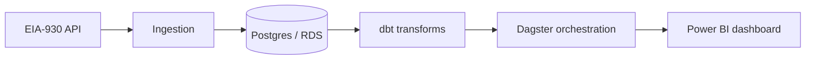
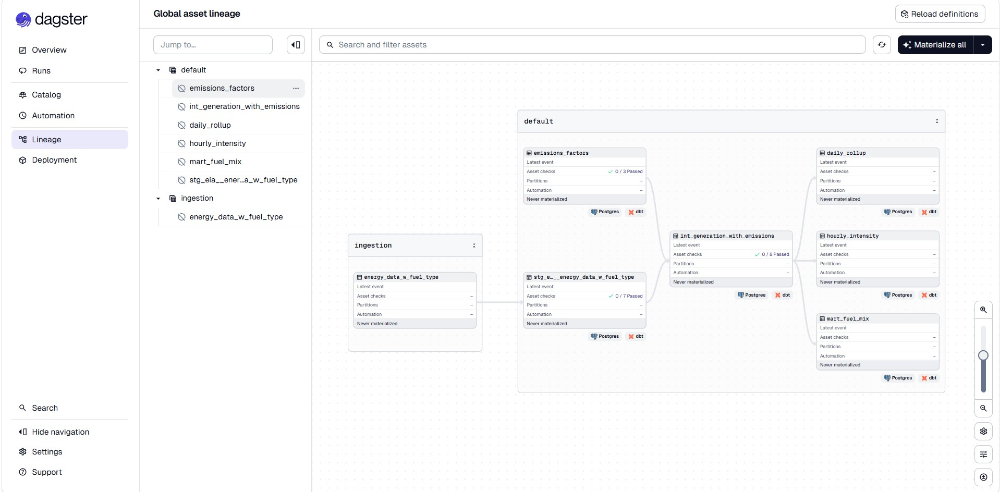
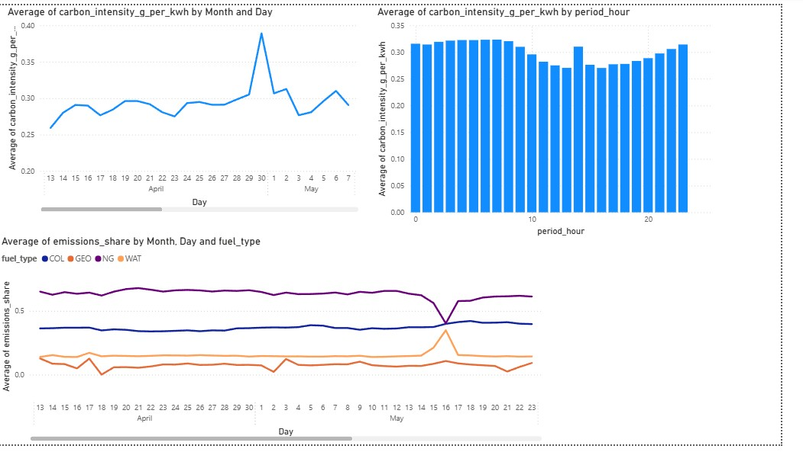

# CarbonMapping Orchestra

**Hourly grid carbon intensity, end to end.**  

This pipeline pulls real-time electricity generation data for the New England grid. Calculates how much carbon the grid is emitting each hour. Surfaces the cleanest times to use power. Ingesting from a live API, transforming through dbt, orchestrated with Dagster

> **Why it matters:** Grid carbon intensity changes hour by hour. Utilities, EV charging apps. Sustainability teams need a reliable, repeatable pipeline. This project turns public EIA data into queryable carbon metrics.

---

### Pipeline (Dagster)

*Asset graph: `energy_data_w_fuel_type` → staging → `int_generation_with_emissions` → `hourly_intensity`, `mart_fuel_mix`, `daily_rollup`.*

### Output (Power BI)

*Dashboard fed from `marts.hourly_intensity`, `marts.mart_fuel_mix`, and `daily_rollup` — daily intensity trends, hourly patterns, fuel-mix shifts (e.g. gas vs hydro).*